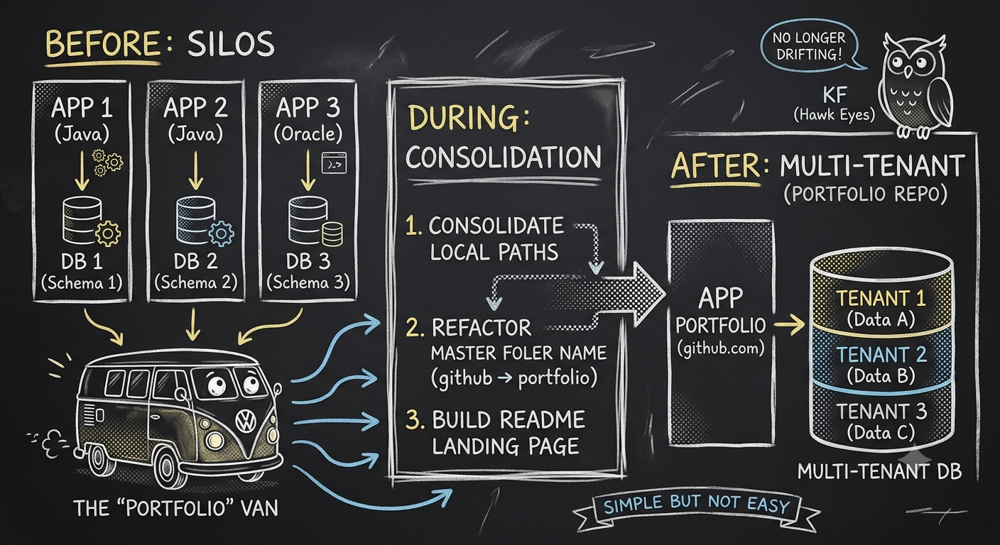

---
# Ken Faris | Oracle Developer
> San Diego, CA | developer_dishwasher@yahoo.com

## Operational Philosophy
Ken Faris implements a rigorous data-validation loop, manually auditing all machine-generated outputs against strict compiler constraints under the recognition that algorithmic entropy and technical drift are active, constant hazards to system integrity.

I treat technical friction as an optimization trigger. Deploying three production-ready portfolio projects in three weeks, I ran an accelerated execution loop—using AI as a force multiplier while double-checking every data block in an isolated environment to guarantee unbroken operation.

---

## Core Engine Repositories

### 1. [java-invariant](./java-invariant)
* **Type:** OOP State Machine & Reference Tracking
* **Runtime:** Java SE 21
* **Engine Data:** Centralized console loop logic driving state-management (add/del/edit) and identity tracking. Double-precision primitive computation for metrics, salaries, and dashboard updates.

### 2. [oracle-multitenant](./oracle-multitenant)
* **Type:** Relational Backend Architecture
* **Engine:** Oracle PL/SQL
* **Engine Data:** Containerized schema migration path converting legacy single-silo non-CDB databases to hierarchical Oracle Multitenant PDB container domains. Enforces stored procedures, cursors, triggers, and programmatic constraints across grade, salary, and course tracking.

### 3. [python-scraper](./python-scraper)
* **Type:** Text Analysis & Hypertext Extraction Engine
* **Runtime:** Python 3 (Requests, BS4, Regex)
* **Engine Data:** Automated pipeline scraping raw hypertext via targeted HTTP headers. Parses, tokenizes, sorts, and strips raw text via regular expressions (`re`) into deduplicated master verification lists.

---

## Technical Specifications & Environment
* **Lab Workstation:** Lenovo P16 i9 | 128GB RAM | NVIDIA RTX 4000 Ada
* **Target Runtimes:** Linux Ubuntu, Fedora, Windows
* **Credentials:** SDSU Developer Certificate (Oracle SQL, PL/SQL, Python, Java) [2026] | UCSD Advanced Track (Linear Algebra for Machine Learning) [2026]
