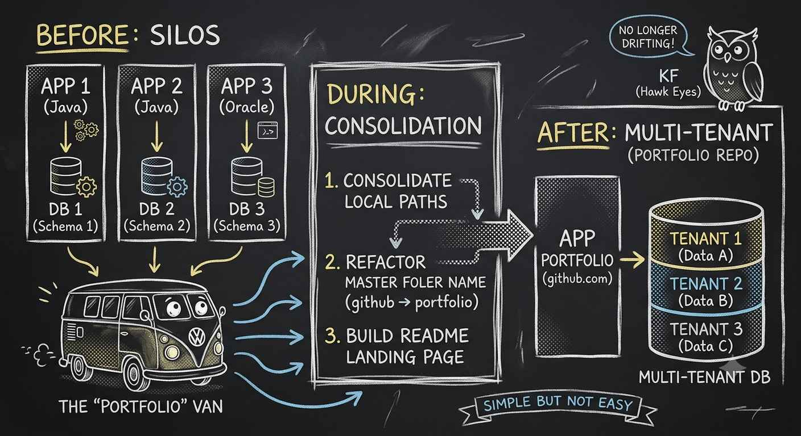

## Ken Faris | Developer
* **Contact:** developer_dishwasher@yahoo.com
* **Location:** Remote - USA

### Operational Philosophy
Read it. Chunk it. Run piece by piece.  Where it breaks, perform textbook fixes. Else come up with a work around.  I showcase three systems that required my operational method. These were done in 3 weeks using AI as an apprentice, for which i directed as a force multiplier.  Ai is error prone but can automate repetitive takes when properly conditioned to help not lead.  Each project isolated and triple checked to get me an 100% / A.  The instructor was treacherous, vaugue and evasive.  I was lucky to have him as my professor.

### Core Engine Repositories

#### 1. java-invariant
* **Type:** Deterministic state machine & reference tracking
* **Runtime:** Java SE 21
* **Architecture:** Centralized console loop logic driving low-latency state management and identity tracking via Reference Variables. Implements BigDecimal precision mapping to compute immutable data structures, completely eliminating floating-point drift across user metrics, salaries, and operations dashboards.

#### 2. oracle-multitenant
* **Type:** Transactional backend consolidation & relational engine
* **Engine:** Oracle PL/SQL
* **Architecture:** Containerized schema migration path transforming legacy single-silo non-CDB instances into hierarchical Oracle Multitenant PDB container domains. Enforces programmatic stored procedures, optimized cursor operations, database triggers, and strict relational constraints across tiered data sets and chronological audit logs.

#### 3. python-scraper
* **Type:** Data extraction & automated text analysis pipeline
* **Runtime:** Python 3 (Requests, BS4, Regex)
* **Architecture:** Automated harvesting pipeline ingesting raw hypertext and unstructured data streams via targeted HTTP headers. Parses, tokenizes, and strips raw text via regular expressions into structured, deduplicated master verification vectors optimized for downstream analytical models.

### Technical Specifications & Environment
* **Hardware:** Lenovo P16 Gen 2 | Intel i9 CPU | 128GB RAM | NVIDIA RTX 4000 Ada GPU
* **Target Platforms:** Linux Ubuntu, Fedora, Windows Server
* **Credentials:** SDSU Professional Certificate (Oracle SQL, PL/SQL, Python, Java) [2026]
* **Vanguard Track:** UCSD Advanced Track (Linear Algebra for Machine Learning) [In Progress - June 2026]

---
