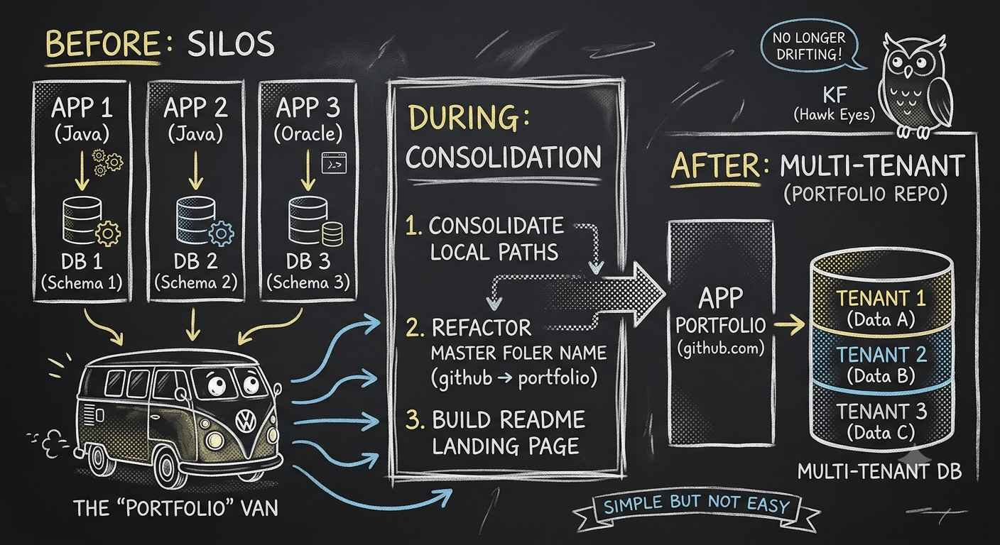

## I SEEK DEV QUEUE CLEAN-UP

SDSU Global Campus certified Oracle PL/SQL, Java, Python Developer.

UCSD Technical Aspects of Artificial Intelligence Certification in progress.

Prefer Oracle. Long ago I cleared system engineer queues. Dev roles only.
 

## I CRAVE ORACLE DATABASE

Any level dev work. I will continue school online. I get A's.

I know migrations, TCP/IP, sockets, SQL, Linux, Win, terminal, regex, queue clearing.

My goal is to keep your queue cleared so i can grow as a developer.

## I BUILT THESE PROJECTS

#### JAVA-INVARIANT
* **Java 21** state machine using **BigDecimal** precision
* Central loop logic eliminating floating-point drift

#### ORACLE-MULTITENANT
* **PL/SQL** migration from non-CDB to **CDB/PDB** domains
* Enforces schema constraints, stored procedures, and triggers

#### PYTHON-SCRAPER
* **Python 3 / Requests / BS4** web scraper
* Parses HTTP streams, strips HTML, and deduplicates text

### PL/SQL Oracle Developer - Java Developer - Python Developer
