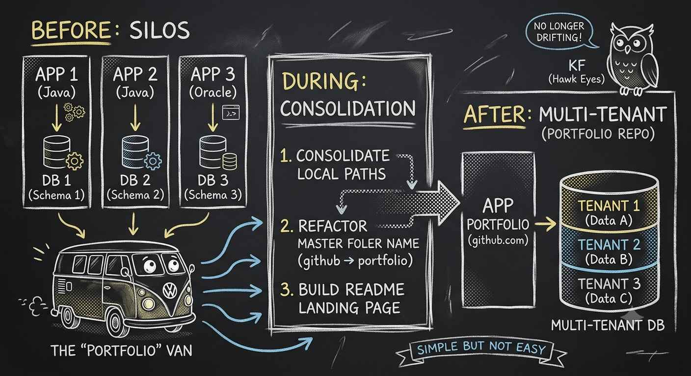

# KENNETH FARIS
[Developer_DishWasher@Yahoo.Com](mailto:Developer_DishWasher@Yahoo.Com)

### SEEKS ORACLE PL/SQL
* Developer Queue Work
* Clear Data Backlogs
* Oracle Dev shop

### MULTITENANT GOAL

### BASELINE KNOWLEDGE
* **DB:** Oracle, PL/SQL, CDB/PDB
* **Languages:** Java 21, Python 3
* **OS:** Linux (Ubuntu, Fedora), Win
* **Security:** CCNA CyberOps Certified
* **Network:** TCP/IP, Sockets, Regex

---

### PROJECTS
**ORACLE-MULTITENANT (PL/SQL):**
* Migrated single-silos to CDB/PDB
* Wrote procedures, triggers, fixes
**WITHROW-SYSTEM (Java 21):**
* Built CLI user admin console
* Used BigDecimal for precision
* Eliminated floating-point drift
**TEXT-ANALYZER (Python 3):**
* Scraped streams via Requests/BS4
* Parsed text logs using regex
* Deduplicated unstructured data

---

### 🎓 TIMELINE & CREDENTIALS
* **Academic Developer** (2024–Present)
* **Cisco Scholarship Recipient**
  Earned CCNA CyberOps Cert.
* **Network Systems Eng.** (Pre-COVID)
  Cleared ticket queues and logs.
* **UCSD AI Certification** (In Progress)
  Taking Probability & Stats now.
  Finished Linear Algebra at 110%.
* **SDSU Global Campus** (Graduated 2026)
  Oracle, PL/SQL, Java, Python Cert.
  Finished 100% on Finals & Projects.
